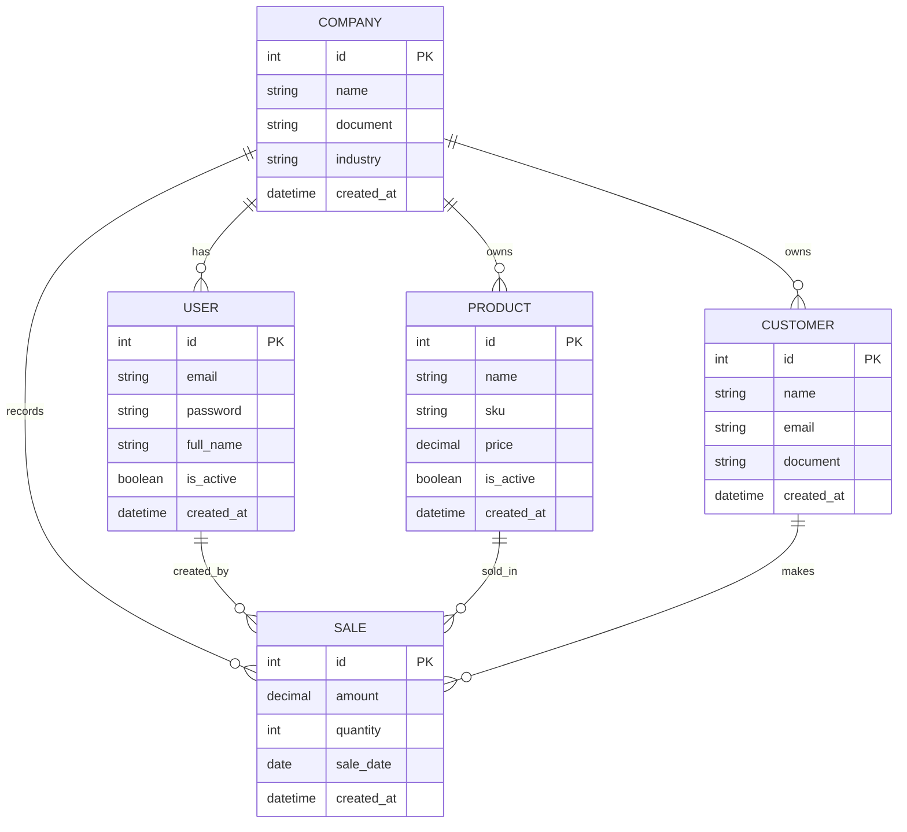

# TradeHub API

A RESTful platform for managing multi-company e-commerce operations, built with Django and Django REST Framework. This API provides endpoints for managing companies, products, customers, and sales, with JWT authentication for secure access.

## Table of Contents

- [Features](#features)
- [Technologies](#technologies)
- [Installation](#installation)
- [Configuration](#configuration)
- [Authentication](#authentication)
- [API Endpoints](#api-endpoints)
- [Database Schema](#database-schema)
- [Usage](#usage)
- [Contributing](#contributing)
- [License](#license)

## Features

- **Authentication**: JWT-based authentication for secure access to the API.
- **Company Management**: Create, read, update, and delete companies.
- **Product Management**: Manage products with SKU, pricing, and availability.
- **Customer Management**: Track customer information and purchase history.
- **Sales Management**: Record and manage sales transactions.
- **Validation**: Built-in validation for data integrity.
- **Pagination**: Support for paginated responses.
- **Filtering**: Filter records based on various criteria.

## Technologies

- **Django**: A high-level Python web framework.
- **Django REST Framework**: A powerful and flexible toolkit for building Web APIs.
- **Django REST Framework SimpleJWT**: For JWT authentication.
- **SQLite**: Default database for development (configurable for production).
- **Python Decouple**: For managing environment variables.
- **Dj-Database-URL**: For parsing database URLs.

## Installation

### Prerequisites

- Python 3.8 or higher
- pip (Python package manager)

### Steps

1. Clone the repository:

   ```bash
   git clone https://github.com/yourusername/tradehub-api.git
   cd tradehub-api
   ```

2. Create a virtual environment:

   ```bash
   python -m venv venv
   source venv/bin/activate  # On Windows, use `venv\Scripts\activate`
   ```

3. Install the dependencies:

   ```bash
   pip install -r requirements.txt
   ```

4. Create a `.env` file based on `.env.example` and configure your environment variables:

   ```bash
   cp .env.example .env
   ```

5. Run the migrations:

   ```bash
   python manage.py migrate
   ```

6. Start the development server:

   ```bash
   python manage.py runserver
   ```

## Configuration

### Environment Variables

The following environment variables can be configured in the `.env` file:

- `SECRET_KEY`: Django secret key for security.
- `DEBUG`: Set to `True` for development, `False` for production.
- `ALLOWED_HOSTS`: List of allowed hosts (e.g., `localhost,127.0.0.1`).
- `DATABASE_URL`: Database connection URL (e.g., `sqlite:///db.sqlite3`).

### Example `.env` File

```env
SECRET_KEY=your-secret-key-here
DEBUG=True
ALLOWED_HOSTS=localhost,127.0.0.1
DATABASE_URL=sqlite:///db.sqlite3
```

## Authentication

This API uses JWT (JSON Web Token) for authentication. The following endpoints are available for authentication:

- **Obtain Token**: `POST /api/v1/authentication/token/`
- **Refresh Token**: `POST /api/v1/authentication/token/refresh/`
- **Verify Token**: `POST /api/v1/authentication/token/verify/`

### Token Configuration

- **Access Token Lifetime**: 5 minutes
- **Refresh Token Lifetime**: 1 day

### Example: Obtain Token

```bash
curl -X POST http://localhost:8000/api/v1/authentication/token/ \
  -H "Content-Type: application/json" \
  -d '{"username": "your_username", "password": "your_password"}'
```

### Example: Refresh Token

```bash
curl -X POST http://localhost:8000/api/v1/authentication/token/refresh/ \
  -H "Content-Type: application/json" \
  -d '{"refresh": "your_refresh_token"}'
```

### Example: Verify Token

```bash
curl -X POST http://localhost:8000/api/v1/authentication/token/verify/ \
  -H "Content-Type: application/json" \
  -d '{"token": "your_access_token"}'
```

### Using the Token

Once you have obtained a token, include it in the `Authorization` header of your requests:

```bash
curl -X GET http://localhost:8000/api/v1/companies/ \
  -H "Authorization: Bearer your_access_token"
```

## API Endpoints

The API is versioned under `/api/v1/`. Below are the available endpoints:

### Authentication

- **Obtain Token**: `POST /api/v1/authentication/token/`
- **Refresh Token**: `POST /api/v1/authentication/token/refresh/`
- **Verify Token**: `POST /api/v1/authentication/token/verify/`

### Companies

- **List Companies**: `GET /api/v1/companies/`
- **Create Company**: `POST /api/v1/companies/`
- **Retrieve Company**: `GET /api/v1/companies/<id>/`
- **Update Company**: `PUT /api/v1/companies/<id>/`
- **Delete Company**: `DELETE /api/v1/companies/<id>/`

### Customers

- **List Customers**: `GET /api/v1/customers/`
- **Create Customer**: `POST /api/v1/customers/`
- **Retrieve Customer**: `GET /api/v1/customers/<id>/`
- **Update Customer**: `PUT /api/v1/customers/<id>/`
- **Delete Customer**: `DELETE /api/v1/customers/<id>/`

### Products

- **List Products**: `GET /api/v1/products/`
- **Create Product**: `POST /api/v1/products/`
- **Retrieve Product**: `GET /api/v1/products/<id>/`
- **Update Product**: `PUT /api/v1/products/<id>/`
- **Delete Product**: `DELETE /api/v1/products/<id>/`

### Sales

- **List Sales**: `GET /api/v1/sales/`
- **Create Sale**: `POST /api/v1/sales/`
- **Retrieve Sale**: `GET /api/v1/sales/<id>/`
- **Update Sale**: `PUT /api/v1/sales/<id>/`
- **Delete Sale**: `DELETE /api/v1/sales/<id>/`

## Database Schema

The database schema is designed to support the following entities and their relationships:

### Entities

1. **Company**: Represents a company with attributes such as name, document, industry, and timestamps.
2. **User**: Represents a user with attributes such as email, password, full name, and timestamps.
3. **Product**: Represents a product with attributes such as name, SKU, price, and timestamps.
4. **Customer**: Represents a customer with attributes such as name, email, document, and timestamps.
5. **Sale**: Represents a sale with attributes such as amount, quantity, sale date, and timestamps.

### Relationships

- **Company to User**: One-to-many relationship (a company can have multiple users).
- **Company to Product**: One-to-many relationship (a company can own multiple products).
- **Company to Customer**: One-to-many relationship (a company can have multiple customers).
- **Company to Sale**: One-to-many relationship (a company can record multiple sales).
- **User to Sale**: One-to-many relationship (a user can create multiple sales).
- **Product to Sale**: One-to-many relationship (a product can be sold in multiple sales).
- **Customer to Sale**: One-to-many relationship (a customer can make multiple sales).

### ER Diagram



## Usage

### Example Requests

#### Obtain JWT Token

```bash
curl -X POST http://localhost:8000/api/v1/authentication/token/ \
  -H "Content-Type: application/json" \
  -d '{"username": "admin", "password": "admin123"}'
```

#### Create a Company (Authenticated)

```bash
curl -X POST http://localhost:8000/api/v1/companies/ \
  -H "Content-Type: application/json" \
  -H "Authorization: Bearer your_access_token" \
  -d '{"name": "Tech Corp", "document": "123456789", "industry": "Technology"}'
```

#### List All Companies (Authenticated)

```bash
curl -X GET http://localhost:8000/api/v1/companies/ \
  -H "Authorization: Bearer your_access_token"
```

#### Create a Product (Authenticated)

```bash
curl -X POST http://localhost:8000/api/v1/products/ \
  -H "Content-Type: application/json" \
  -H "Authorization: Bearer your_access_token" \
  -d '{"name": "Laptop", "sku": "LAP123", "price": 999.99, "company": 1}'
```

#### List All Products (Authenticated)

```bash
curl -X GET http://localhost:8000/api/v1/products/ \
  -H "Authorization: Bearer your_access_token"
```

## Contributing

Contributions are welcome! Please follow these steps:

1. Fork the repository.
2. Create a new branch (`git checkout -b feature-branch`).
3. Make your changes.
4. Commit your changes (`git commit -am 'Add new feature'`).
5. Push to the branch (`git push origin feature-branch`).
6. Open a pull request.

## License

This project is licensed under the MIT License. See the [LICENSE](LICENSE) file for details.
